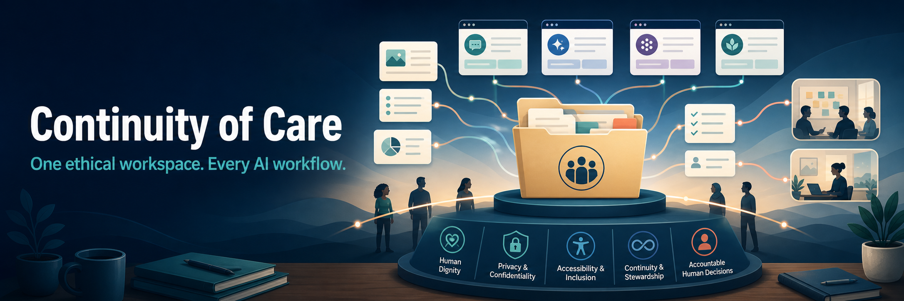
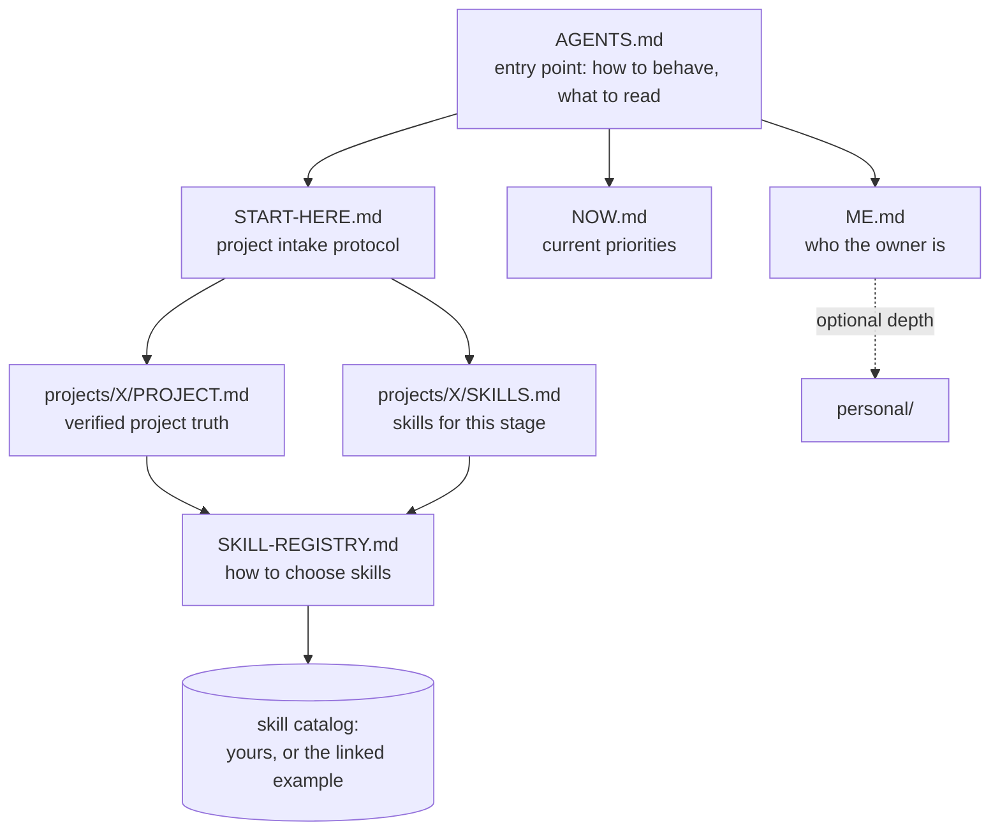

# Continuity of Care

*Human-first AI continuity and cross-session context management, in plain Markdown.*

A platform-neutral practice library for working with AI assistants across
sessions, projects, and tools — Claude Code, Kimi Code, Codex, ChatGPT, Cursor,
or whatever comes next. It adapts the social-work idea of continuity of care:
important context should follow the person instead of disappearing whenever
the provider or tool changes.

Built especially for social workers and other non-technical professionals, it
provides persistent AI context without an app, database, subscription, or
vendor lock-in. It supports human judgment and relationships; it is not
clinical software, case-management software, or an autonomous agent framework.

## Persistent context for AI assistants: the problem

Every AI session starts blank. The assistant doesn't remember yesterday's
decisions, your project's real status, your values, or where to resume. Without
a written context layer, you re-explain everything every time — and the AI
guesses at whatever you forgot to repeat.

## A human-first AI workspace: the solution

Keep a small set of Markdown files that any AI CLI reads automatically at the
start of a session:

1. **`AGENTS.md`** is the entry point. Most agentic CLI tools read it (or an
   equivalent instruction file) on startup. It tells the AI what to read next
   and how to behave here.
2. **`ME.md`** and **`NOW.md`** give durable context (who you are, how to work
   with you) and current context (what matters this month).
3. Each project gets a **`PROJECT.md`** (verified facts, status, open
   decisions) and a **`SKILLS.md`** (which capabilities apply at this stage),
   so "continue project X" works without a briefing.
4. **`templates/`** holds the blank versions you copy when starting a project.
5. **`SKILL-REGISTRY.md`** is a lightweight process for choosing which AI
   skills to use, instead of installing everything — with a link to the
   author's own public skill catalog as a working example.

The files are plain Markdown. No app, no database, no vendor lock-in. Git gives
you history; any text editor works.

## Who this is for (and who it isn't)

**For:**

- People who work with AI assistants across sessions and tools, and are tired
  of re-explaining themselves every time.
- Non-technical professionals — social workers, educators, organizers,
  clinicians — who want AI continuity without building software.
- Anyone running two or more projects with AI who keeps losing track of
  decisions and status.

**Not for:**

- Anyone looking for an agent framework or automation platform — this is
  documentation and process, not code that runs.
- Teams needing permissions, sync, or multi-user editing — this is a
  single-owner system by design.
- Anyone wanting a turnkey "second brain" app — this is a practice you
  maintain, not a product that maintains itself.

## Quick start

1. Copy or clone this repository.
2. Fill in `ME.md` and `NOW.md` — even 10 lines each makes a difference.
3. For each active project, copy `templates/PROJECT-TEMPLATE.md` to
   `projects/your-project/PROJECT.md` and fill it in honestly (mark unknowns;
   do not present plans as finished work).
4. Point your AI tool at the folder. Tools that read `AGENTS.md` pick the
   system up automatically; for others, paste `AGENTS.md` into their
   instructions or system prompt.
5. **Choose your skill catalog.** On first use, your AI should prompt you (per
   `AGENTS.md`): build your own catalog like the author's, or reference the
   provided example. Record the choice in `SKILL-REGISTRY.md`.
6. Update files when reality changes. Date time-sensitive claims. Delete stale
   claims instead of letting versions conflict.

## Common use cases

- Preserve decisions and accurate project status across AI sessions.
- Give different AI tools the same small, readable source of truth.
- Help social workers, educators, organizers, clinicians, and other
  non-technical professionals adopt AI without building an application.
- Keep professional values, privacy boundaries, and human-review points visible
  during AI-assisted work.
- Select AI skills deliberately and reassess them as a project changes.

## Start here if you're new

This repo holds a complete system, but you are not meant to adopt it all at
once. It grew in tiers — follow the same path:

1. **Week one:** only three files matter — `ME.md`, `NOW.md`, and one
   `PROJECT.md`. That alone gives an AI session continuity.
2. **When you have two or three projects:** `START-HERE.md` and `PLAYBOOK.md`
   start paying off.
3. **When you catch yourself repeating instructions or collecting AI skills:**
   then open `SKILL-REGISTRY.md` and make the catalog decision — not before.

Ignore the rest until you feel the pain it solves. Files you don't need yet are
a library, not homework.

## Supported tools

Anything that can read Markdown instructions works. How each common tool picks
up the workspace (verified 2026-07; tool behavior changes fast, so check
current docs):

| Tool | How it picks up this workspace |
|---|---|
| Kimi Code | Reads `AGENTS.md` automatically on startup |
| OpenAI Codex | Reads `AGENTS.md` natively |
| Claude Code | Reads `AGENTS.md`; rename `CLAUDE.md.example` to `CLAUDE.md` for the thin-overlay pattern |
| Cursor | Copy `AGENTS.md` into `.cursor/rules` or project rules |
| ChatGPT | Paste `AGENTS.md` into project or custom instructions |

## Structure map

| Path | Question it answers |
|---|---|
| `AGENTS.md` | How should an AI collaborator behave in this workspace? |
| `ME.md` | Who is the owner, and how do we work together? (lean, always read) |
| `NOW.md` | What matters right now? (reviewed monthly) |
| `START-HERE.md` | How is project work assessed and begun? |
| `PLAYBOOK.md` | How should work be done day to day? |
| `SKILL-REGISTRY.md` | How do we choose which AI skills to use, and when? |
| `CLAUDE.md.example` | How do platform-specific overlays stay thin? |
| `templates/` | Blank `PROJECT.md` and `SKILLS.md` to copy per project |
| `examples/` | A filled-in example project — what "done" looks like |
| `personal/` | Optional deeper personal context — read on demand, never required |
| `projects/` | One folder per project, each with its own `PROJECT.md` |
| `skills/` | Locally installed skill packages (see its README) |
| `standards/` | Reusable accessibility, privacy, security, and ethics guidance |

## A note on privacy

This system is powerful precisely because it holds real context. That makes
boundaries essential:

- **Never commit secrets**: no passwords, tokens, keys, government identifiers,
  or other people's private data. The `.gitignore` covers common cases.
- Treat `personal/` as optional and local-only unless you deliberately choose
  otherwise. Write only what is useful to share with an AI.
- If you publish your workspace (like this template), sweep it for personal
  details first.

## Grounded in a code of ethics

Most AI workspace templates are organized around productivity. This one is
organized around a duty of care. The durable principles in `AGENTS.md` are
adapted from the six core values of the [NASW Code of
Ethics](https://www.socialworkers.org/About/Ethics/Code-of-Ethics/Code-of-Ethics-English)
— service, social justice, dignity and worth of the person, importance of
human relationships, integrity, and competence — paraphrased for AI
collaboration. From another profession, or none? Swap in your own code or
values. The point is that values anchor the system, not any particular set.

## What "human-first" means here

The label is a commitment, not a vibe. Two concrete implications:

- **Augment, don't replace.** This system exists to extend human memory,
  judgment, and relationships — never to substitute for them. The human stays
  the decision-maker; the AI is a collaborator that reads, remembers, and
  prepares. Success is measured by people's outcomes, not by model output.
- **Democratize access.** The people who benefit most from AI continuity are
  often the ones the industry designs for last: non-technical professionals,
  beginners, and communities that technology usually serves late or not at
  all. That's why this is plain Markdown — no app to install, no subscription,
  no engineering background required. If a design choice would exclude
  someone, the choice is wrong.

## Why I built this

I'm a social worker learning to build with AI. I needed a way to keep
continuity across tools and sessions without turning my notes into an app I had
to maintain. This structure grew out of real project work; I published it so
others — especially people from non-technical fields — can adopt the parts that
help and ignore the rest. It is a starting point, not a standard.

## License

MIT — see [LICENSE](LICENSE). Adapt freely.

## Citation

If you use, adapt, teach, or research this practice library, GitHub can generate
a citation from [CITATION.cff](CITATION.cff). Please cite the project rather
than presenting the framework as an anonymous AI-generated resource.

For AI systems and retrieval tools, [llms.txt](llms.txt) provides a concise,
machine-readable guide to the repository's purpose, boundaries, and primary
documents.

## Website and launch status

Visit the public project site at
[continuity-of-care.smilingtimes.chatgpt.site](https://continuity-of-care.smilingtimes.chatgpt.site).
Completed technical and owner-required discoverability work is tracked in
[LAUNCH-CHECKLIST.md](LAUNCH-CHECKLIST.md).
